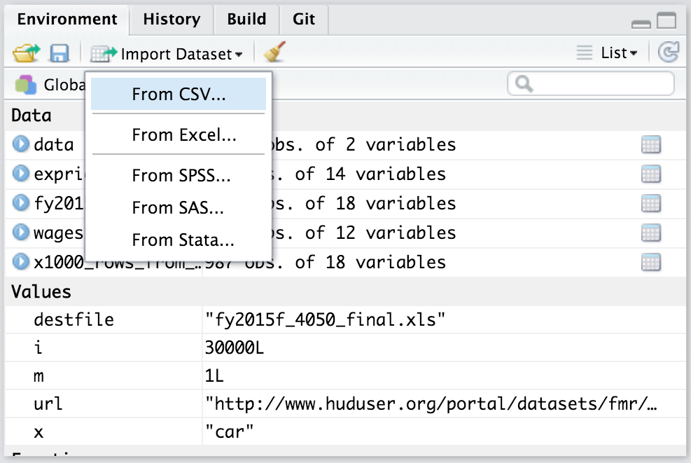
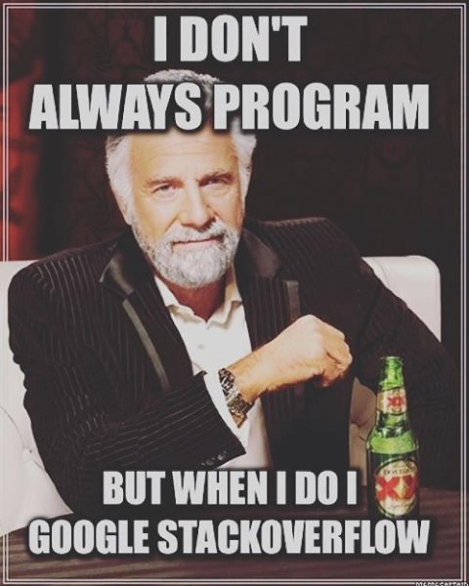

# Good practices

## RStudio

Download the latest version of [RStudio](https://www.rstudio.com/products/rstudio/download/#download) (> 1.1) and use it!

RStudio features:

- everything you can expect from a good IDE
- keyboard shortcuts I use
    1. *Ctrl + Space* (auto-completion, better than *Tab*)
    2. *Ctrl + Up* (command history & search)
    3. *Ctrl + Click* (function source code)
    3. *Ctrl + Enter* (execute line of code)
    4. *Ctrl + Shift + K* (knit)
    4. *Ctrl + Shift + B* (build package, website or book)
    4. *Ctrl + Shift + M* (pipe)
    4. *Alt + Shift + K* to see all shortcuts...
- Panels (everything is integrated, including **Git** and a terminal)
- Interactive data importation from files and connections (see [this webinar](https://www.rstudio.com/resources/webinars/importing-data-into-r/))

- **R Projects**

## Getting help

Can't remember useful functions? Use [cheat sheets](https://www.rstudio.com/resources/cheatsheets/).

You can search for specific R stuff on https://rseek.org/. You should also read documentations carefully. If you're using a package, search for vignettes and a GitHub repository.

You can also use [Stack Overflow](https://stackoverflow.com/). The most common use of Stack Overflow is when you have an error or a question, you google it, and most of the times the first links are Q/A on Stack Overflow.

You can ask questions on Stack Overflow (using the tag `r`). You need to [make a great R reproducible example](https://stackoverflow.com/questions/5963269/how-to-make-a-great-r-reproducible-example) if you want your question to be answered. Most of the times, while making this reproducible example, you will find the answer to your problem.

If you're confident enough in your R skills, you can go to the next step and [answer questions on Stack Overflow](https://stackoverflow.com/unanswered/tagged/r?tab=newest). It's a good way to increase your skills, or just to [procrastinate while writing a scientific manuscript](https://privefl.github.io/blog/one-month-as-a-procrastinator-on-stack-overflow/).
