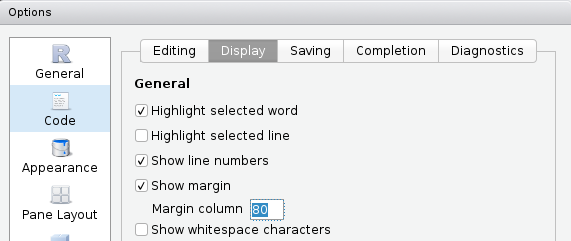

# Good practices


## Coding style

> Good coding style is like correct punctuation: you can manage without it, butitsuremakesthingseasiertoread. 
>
> -- Hadley Wickham

Please make your code readable by following e.g. [this coding style](http://style.tidyverse.org/) (examples below come from this guide).

You can use [package **styler**](https://github.com/r-lib/styler) (that provides RStudio addins) to correct your style:


### Naming

Be smart with your naming. I can't tell the number of times I've seen `df <- as.matrix(mtcars)` on Stack Overflow. 

### Spacing

Put a space before and after `=` when naming arguments in function calls.
Most infix operators (`==`, `+`, `-`, `<-`, etc.) are also surrounded by
spaces, except those with relatively high precedence: `^`, `:`, `::`, and `:::`. Always put a space after a comma, and never before (just like in regular English).


```r
# Good
average <- mean((feet / 12) + inches, na.rm = TRUE)
x <- 1:10
base::sum

# Bad
average<-mean(feet/12+inches,na.rm=TRUE)
x <- 1 : 10
base :: sum
```

### Indenting

Curly braces, `{}`, define the most important hierarchy of R code. To make this hierarchy easy to see, always indent the code inside `{}` by two spaces. This should be automatic in RStudio.


```r
# Good
if (y < 0 && debug) {
  message("y is negative")
}

if (y == 0) {
  if (x > 0) {
    log(x)
  } else {
    message("x is negative or zero")
  }
} else {
  y ^ x
}

# Bad
if (y < 0 && debug)
message("Y is negative")

if (y == 0)
{
    if (x > 0) {
      log(x)
    } else {
  message("x is negative or zero")
    }
} else { y ^ x }
```

### Long lines

Strive to limit your code to 80 characters per line. This fits comfortably on a 
printed page with a reasonably sized font. If you find yourself running out of 
room, this is a good indication that you should encapsulate some of the work in 
a separate function.




If a function call is too long to fit on a single line, use one line for 
the function name, for each argument, and for the closing `)`. 
This makes the code easier to read and to modify later. 


### Other

- Use `<-`, not `=`, for assignment. Keep `=` for parameters.


```r
# Good
x <- 5
system.time(
  x <- rnorm(1e6)
)

# Bad
x = 5
system.time(
  x = rnorm(1e6)
)
```

- Don't put `;` at the end of a line, and avoid multiple commands 
on the same line.

- Only use `return()` for early returns. Otherwise rely on R to return the result of the last evaluated expression.


```r
# Good
add_two <- function(x, y) {
  x + y
}

# Bad
add_two <- function(x, y) {
  return(x + y)
}
```

- Use `"`, not `'`, for quoting text. The only exception is when the text already contains double quotes and no single quotes.


```r
# Good
"Text"
'Text with "quotes"'
'<a href="http://style.tidyverse.org">A link</a>'

# Bad
'Text'
'Text with "double" and \'single\' quotes'
```


## RStudio

Download a recent version of [RStudio](https://www.rstudio.com/products/rstudio/download/#download) (>= 1.2) and use it!

Learn more about the new features of RStudio at https://rstudio.com/products/rstudio/release-notes/.

RStudio features:

- everything you can expect from a good IDE
- keyboard shortcuts I use
    1. *Ctrl + Space* (auto-completion, better than *Tab*)
    2. *Ctrl + Up* (command history & search)
    3. *Ctrl + Click* (function source code)
    3. *Ctrl + Enter* (execute line of code)
    4. *Ctrl + Shift + A* (reformat code)
    4. *Ctrl + Shift + C* (comment/uncomment selected lines)
    4. *Ctrl + Shift + K* (knit)
    4. *Ctrl + Shift + B* (build package, website or book)
    4. *Ctrl + Shift + M* (pipe)
    4. *Alt + Shift + K* to see all shortcuts...
- Panels (everything is integrated, including Git and a terminal)
- Interactive data importation from files and connections (see [this webinar](https://www.rstudio.com/resources/webinars/importing-data-into-r/))


- Use [code diagnostics](https://support.rstudio.com/hc/en-us/articles/205753617-Code-Diagnostics-in-the-RStudio-IDE):


- **RStudio Projects**: 
    - Meaningful structure in one folder
    - The working directory automatically switches to the project's folder
    - The *File* tab displays the associated files and folders in the project
    - History of R commands and open files
    - Any settings associated with the project, such as Git settings, are loaded. Note that you can have a *.Rprofile* file in the project's root directory to enable project-specific settings to be loaded each time people open the project.

Read more at https://www.tidyverse.org/articles/2017/12/workflow-vs-script/ and also see chapter [*Efficient set-up*](https://bookdown.org/csgillespie/efficientR/set-up.html) of book *Efficient R programming*.

## Version control (Git) {#git}

### Why use Git? You don't use Git?

<div class="figure" style="text-align: center">

<p class="caption">(\#fig:unnamed-chunk-12)You don't use Version Control?</p>
</div>

Have you ever:

- Made a change to code, realized it was a mistake and wanted to revert back?
- Lost code or had a backup that was too old?
- Wanted to submit a change to someone else's code?
- Wanted to share your code, or let other people work on your code?

In these cases, and probably many others, a version control system should make your life easier (see https://stackoverflow.com/a/1408464/6103040).

- Version control for the researcher: don't do that, use Git


- Version control for the data analyst: reproducible workflow

<center>
<iframe width="560" height="315" src="https://www.youtube.com/embed/s3JldKoA0zw" frameborder="0" allow="autoplay; encrypted-media" allowfullscreen></iframe>
</center>

Also, see https://stackoverflow.com/q/2712421/6103040.

- Use version control to work from anywhere


- Working with GitHub can be a line on your CV ([read more](https://github.com/blog/2336-invest-in-tools-students-can-grow-with-github-and-rstudio-for-data-science-at-duke-university)):

> A lot of students have said to me later, even first-year undergraduates, that using GitHub has helped them a lot when they went for an internship or a research position interview.
>
> They are able to say, "Oh, I already have worked with GitHub. I'm familiar with it. I know how it works.” So I think they are at least able to put that on their CV and go into a situation where there's a research or data analysis team and say, "Yeah, sure. I am actually familiar with the same tools that you use."
>
> -- Mine Cetinkaya-Rundel, Duke University, RStudio

- Be able to get websites for your packages with [pkgdown](http://pkgdown.r-lib.org/), for your book (like this one!) with [bookdown](https://bookdown.org/), for your personal webpage with [R Markdown Websites](https://rmarkdown.rstudio.com/rmarkdown_websites.html) or [blogdown](https://bookdown.org/yihui/blogdown/).


### About Git

- Main Git platforms (share your code, collaborate):
    - [GitHub](https://github.com/), [documentation](https://guides.github.com/activities/hello-world/) (only free for public repositories, now owned by Microsoft)
    - [GitLab UGA](https://gricad-gitlab.univ-grenoble-alpes.fr/) ([documentation](https://docs.gricad-pages.univ-grenoble-alpes.fr/help/)) or just [GitLab](https://about.gitlab.com/) (open source & free)
    - [Bitbucket](https://bitbucket.org/) (free when you have less than 5 collaborators)
    - any server..

- 4 main commands:
    - *add*: add files to be part of the next commit
    - *commit*: snapshot of your code at a specified point in time (you can and you should use this even when having no internet connection)
    - *push*: merge your local modifications with the main project
    - *pull*: update your local project with the latest version of the main project


- Simple (solo) use of git to prevent merge conflicts:
    - after opening a project, always pull
    - before closing a project, always commit/push
    
- Use git even when you do not have any internet connection! (e.g. on a secure server) Just use commits for version control locally.

- How to link between an RStudio project and a GitHub repository?

<center>
<iframe width="560" height="315" src="https://www.youtube.com/embed/8Q3fYwgyNGQ" frameborder="0" allow="autoplay; encrypted-media" allowfullscreen></iframe>
</center>

For Mac users, you might need to use the terminal for `git clone`, then create the RStudio project from the existing directory. If you have some permission denied for the public key, you might also need to run `ssh-agent -s &&
ssh-add <path_to_public_key>` (cf. [this SO answer](https://stackoverflow.com/a/30806058/6103040)).

- Help with Git:
    - [Happy Git and GitHub for the useR](http://happygitwithr.com/)
    - [Git cheat sheet](https://services.github.com/on-demand/downloads/github-git-cheat-sheet.pdf)
    - [When things go wrong](https://github.com/k88hudson/git-flight-rules)
    - [To fix a mistake](http://ohshitgit.com/)
    - [Create a new branch with git and manage branches](https://github.com/Kunena/Kunena-Forum/wiki/Create-a-new-branch-with-git-and-manage-branches)


## Getting help

### Help yourself, learn how to debug

A basic solution is to print everything, but it's usually not working well on complex problems. A convenient solution to see all the variables' states in your code is to place some `browser()` from where you want to check the variables' states. To debug functions, `debugonce()` is also very useful.


```r
my_log <- function(x) log(x - 1)

my_fun <- function(a, b) {
  # browser()
  la <- my_log(a) 
  lb <- my_log(b)
  la + lb
}
my_fun(1, 0)
```

```
#> Warning in log(x - 1): NaNs produced
```

```
#> [1] NaN
```

Try to uncomment `browser()` or use `debugonce(my_fun)`:


```r
debugonce(my_fun)
my_fun(1, 0)
```

Learn more with [this book chapter](https://bookdown.org/rdpeng/rprogdatascience/debugging.html), [this other book chapter](http://adv-r.had.co.nz/Exceptions-Debugging.html), [this webinar](https://www.rstudio.com/resources/webinars/debugging-techniques-in-rstudio/) and [this RStudio article](https://support.rstudio.com/hc/en-us/articles/205612627-Debugging-with-the-RStudio-IDE).


### External help

Can't remember useful functions? Use [cheat sheets](https://www.rstudio.com/resources/cheatsheets/).

You can search for specific R stuff on https://rseek.org/. You should also read documentations carefully. If you're using a package, search for vignettes and a GitHub repository.

You can also use [Stack Overflow](https://stackoverflow.com/). The most common use of Stack Overflow is when you have an error or a question, you google it, and most of the times the first links are Q/A on Stack Overflow.


You can ask questions on Stack Overflow (using the tag `r`). You need to [make a great R reproducible example](https://stackoverflow.com/questions/5963269/how-to-make-a-great-r-reproducible-example) if you want your question to be answered. Sometimes, while making this reproducible example, you find the answer to your problem.

If you're confident enough with your R skills, you can take the next step and [answer questions on Stack Overflow](https://stackoverflow.com/unanswered/tagged/r?tab=newest). It's a good way to increase your skills, or just to [procrastinate while writing a scientific manuscript](https://privefl.github.io/blog/one-month-as-a-procrastinator-on-stack-overflow/).

You can also join communities, e.g. [join the French-speaking R community](https://join.slack.com/t/r-grrr/shared_invite/enQtMzI4MzgwNTc4OTAxLWZlOGZiZTBiMWU0NDQ3OTYzOGE1YThiODgwZWNhNWEyYjI4ZDJiNmNhY2YyYWI5YzFiOTFkNDYxYzkwODUwNWM) or [join the R-Ladies community](https://rladies-community-slack.herokuapp.com/) on Slack. These are generally much friendlier and welcoming spaces compared to Stack Overflow.
