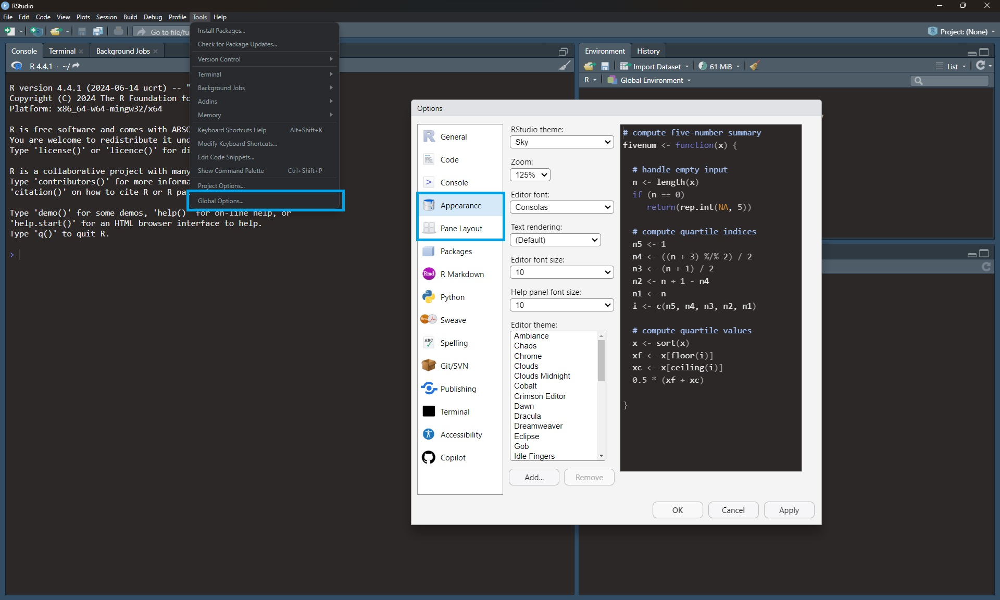
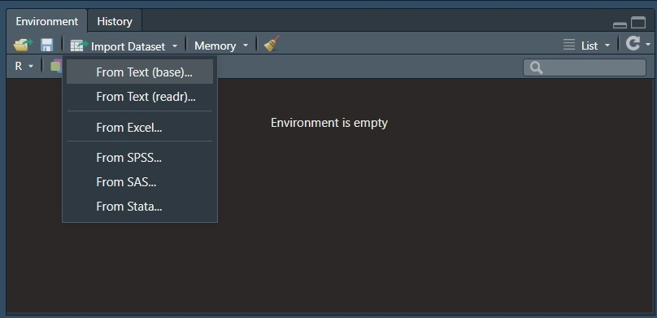
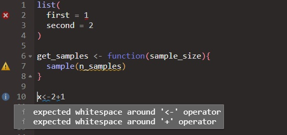
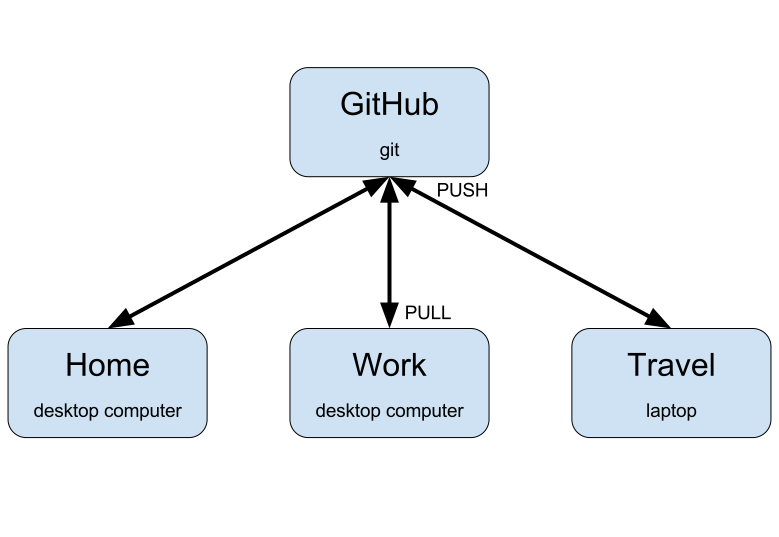

# Good practices

```{r, include=FALSE}
WORDS_TO_IGNORE <- c("butitsuremakesthingseasiertoread", "addin", "Rproj", "Brun", "Julien", "CLI", "GPG", "MRE", "MREs", "Cheatsheets")
source("knitr-options.R")
source("spelling-check.R")
```

In the following, we will consider some good practices for writing `R` code. But before we dive into that topic, let us explain why code needs to be clean and efficient. First, if you are working in a team, writing efficient and clean code makes it a lot easier for you colleagues to understand, debug and improve it. If you want your colleagues or collaborators to reuse your code, it should be readable and easy to follow. Second, you can spare your future self a lot of frustration by writing clean code from the beginning. By doing that, you won't have to ask yourself 

**What the hell am I doing in this function?** 


## Coding style

> Good coding style is like correct punctuation: you can manage without it, butitsuremakesthingseasiertoread. 
>
> `r tufte::quote_footer('--- Hadley Wickham')`

Please make your code readable by following the available style guides. We recommend you take a look at the [tidyverse style guide](http://style.tidyverse.org/). In the following, we provide some examples from this guide.

### Naming

Be smart with your naming. You won't believe how often we have seen `df <- as.matrix(mtcars)` on Stack Overflow. Use meaningful and concise names for your files, data sets, and functions; you will save yourself a lot of time.
For example, consider the following piece of code
```{r eval=FALSE}
dat1 <- tidytuesdayR::tt_load("2020-01-14")[[1]]
dat2 <- dat1[dat1$category == "animal",]
dat3 <- dat1[dat1$strength == 7,]

fct1 <- function(tbl, n = 5) {
  
  tbl <- tbl[complete.cases(tbl$rank),]
  tbl[tbl$rank <= n, 2]
}
```
Looking only at this code, do you have any idea what data is stored in `dat1`, `dat2` and `dat3`? Not really, right? Now imagine, you have 500 lines of code analyzing and visualizing the three different data sets using numerous functions. You would probably get confused about the different data sets and functions quite quick. Now consider the following lines of code
```{r eval=FALSE, tidy='styler', collapse=TRUE}
passwords <- tidytuesdayR::tt_load("2020-01-14")[[1]]
password_category <- passwords[passwords$category == "animal",]
password_strength <- passwords[passwords$strength == 7,]

get_popular_passwords <- function(tbl, n = 5) {
  
  tbl <- tbl[complete.cases(tbl$rank),]
  tbl[tbl$rank <= n, 2]
}
```
This code is identical to the previous code; except for the names. But it is much easier to read and understand. Let us improve the code even more by adding comments.
```{r eval=FALSE, tidy='styler', collapse=TRUE}
# Loading the passwords data
passwords <- tidytuesdayR::tt_load("2020-01-14")[[1]]
# Extracting passwords within the category "animal"
password_category <- passwords[passwords$category == "animal",]
# Extracting passwords with a quality of 7
password_strength <- passwords[passwords$strength == 7,]

# Function: extracts the n most popular passwords
get_popular_passwords <- function(tbl, n = 5) {
  
  tbl <- tbl[complete.cases(tbl$rank),]
  tbl[tbl$rank <= n, 2]
}
```
When commenting code, you should focus on explaining the "why" instead of the "what" or "how". Comments should be in sentence case, and only end with a full stop if they contain at least two sentences.

Suggestions for naming:

* For files names, use underscore separated strings. All words should be lower case, e.g. `fit_models.R` or `utility_functions.R` (with consideration for operating systems with a case-sensitive file systems). Never have file names that only differ in their capitalization! Avoid using special characters in file names.
* For function names, use only lowercase letters and numbers separated by an underscore (`_`), e.g. `compute_mean`. Avoid using dots in function names, as they should be reserved exclusively for the S3 object system. Generally, function names should be verbs.
* For variable names, use only lowercase letters and numbers separated by an underscore (`_`), e.g. `day_1`.
Avoid re-using names of common functions and variables (such as `mean`, `c` or `T`), as this may cause confusion for the readers. Generally, variable names should be nouns. 

### Spacing

Place a space before and after `=` when naming arguments in function calls.
Most infix operators (`==`, `+`, `-`, `<-`, etc.) are also surrounded by spaces, except 

* those with high precedence (`^`, `:`, `::`, and `:::`, `$`, `[`, `[[`),
* `!!` (bang-bang) and `!!!` (bang-bang-bang) when used in tidy evaluation,
* the help operator `?`. 

```{r, eval=FALSE}
# Good
average <- mean((feet / 12) + inches, na.rm = TRUE)
x <- 1:10
base::sum
?mean

# Unfortunate
average<-mean(feet/12+inches,na.rm=TRUE)
x <- 1 : 10
base :: sum
? mean
```
Always put a space after a comma, and never before (just like in regular English).
```{r, eval=FALSE}

# Good
x[, 1]

# Unfortunate
x[,1]
x[ ,1]
x[ , 1]
```
For parenthesis, there are three different rules. When parentheses are used in connection to regular function calls, they are not surround by space:
```{r, eval=FALSE}
# Good
mean(x, na.rm = TRUE)

# Unfortunate
mean (x, na.rm = TRUE)
mean( x, na.rm = TRUE )
```
However, when the parentheses are used with `if`, `for`, or `while`, they are surrounded by space:
```{r, eval=FALSE}
# Good
if (debug) {
  show(x)
}

# Unfortunate
if(debug){
  show(x)
}
```
When the parentheses are used for function arguments, you put a space after the closing parenthesis `)`:
```{r, eval=FALSE}
# Good
function(x) {}

# Unfortunate
function (x) {}
function(x){}
```
Finally, the pipe ` %>%` should always have a space before it, and it is usually followed by a new line. 
```{r, eval=FALSE}
# Good
iris %>%
  group_by(Species) %>%
  summarize_if(is.numeric, mean) %>%
  ungroup() %>%
  gather(measure, value, -Species) %>%
  arrange(value)

# Unfortunate
iris %>% group_by(Species) %>% summarize_all(mean) %>%
ungroup %>% gather(measure, value, -Species) %>%
arrange(value)
```
We will return to the pipe operator in Chapter \@ref(tidyverse). The same styling suggestions also hold for the operator that separates `ggplot2` layers, `+`. You will meet this operator again in Chapter \@ref(tidyverse).

### Indenting

Curly braces, `{}`, define the most important hierarchy of `R` code. To make this hierarchy easy to see, always indent the code inside `{}` by two spaces. This should be automatic in RStudio.

```{r, eval=FALSE}
# Good
if (y < 0 && debug) {
  message("y is negative")
}

if (y == 0) {
  if (x > 0) {
    log(x)
  } else {
    message("x is negative or zero")
  }
} else {
  y ^ x
}

# Unfortunate
if (y < 0 && debug)
message("Y is negative")

if (y == 0)
{
    if (x > 0) {
      log(x)
    } else {
  message("x is negative or zero")
    }
} else { y ^ x }
```

### Long lines

Strive to limit your code to 80 characters per line. This fits comfortably on your screen with a reasonably sized font. If you find yourself running out of room, this is a good indication that you should encapsulate some of the work in a separate function. To change the margin in RStudio go to Tools -> Global Options -> Code -> Display, and set `Margin column:` to 80.

<center>
<video width="560" height="315" autoplay loop muted preload="true" poster="images/margin80.png"> 
<source src="Clips/Change_margin_column.mp4" type="video/mp4">
Your browser does not support the video tag.
</video>
</center>

### Other

- Use `<-`, not `=`, for assignment. Keep `=` for parameters.

```{r, eval=FALSE}
# Good
x <- 5
system.time(
  x <- rnorm(1e6)
)

# Unfortunate
x = 5
system.time(
  x = rnorm(1e6)
)
```

- Don't end a line of code with `;`, and avoid multiple commands 
on the same line.

- Only use `return()` for early returns. Otherwise rely on `R` to return the result of the last evaluated expression. Moreover, return statements should always be on their own line.

```{r, eval=FALSE}
# Good
add_two <- function(x, y) {
  x + y
}

# Unfortunate
add_two <- function(x, y) {
  return(x + y)
}
```

- Use `"`, not `'`, for quoting text. The only exception is when the text already contains double quotes and no single quotes.

```{r, eval=FALSE}
# Good
"Text"
'Text with "quotes"'
'<a href="http://style.tidyverse.org">A link</a>'

# Unfortunate
'Text'
'Text with "double" and \'single\' quotes'
```

- Use `TRUE` and `FALSE` instead of `T` and `F`.

### Code organization

The way the code is organized within a single file significantly impacts the readability. 
We suggest to start each file with a comment holding a description of the file, who wrote it,
and when it was last updated. You may want to set a default template that is used each time you open a new `.R` script. To do this, you have to create a `templates` folder in `AppData/Roaming/RStudio/` and include a `default.R` file with the desired template.

```{r, eval=FALSE, tidy='styler', collapse=TRUE}
# Create a template folder
fs::dir_create(path = "~/AppData/Roaming/RStudio/templates")

# Create the file
fs::file_create(path = "~/AppData/Roaming/RStudio/templates/default.R")

# Open the file in RStudio
usethis::edit_file("~/AppData/Roaming/RStudio/templates/default.R")
```
For example, you can add the following comments to `default.R`:
```{r eval=FALSE}
######################################################################
## Title        :
##
## Description  :
##
## Author       :
##
## Date         :
######################################################################
##
## Loading required libraries:########################################
```
Remember to save the changes you made to `default.R`. 

After the comment section, you should load all required add-on packages using `library()`. This is more transparent than having many `library()` calls throughout your entire code. Afterwards, any required files should be sourced using `source()`. Again, this is more transparent than having many `source()` calls throughout your entire code. Finally, you can start your code. Within your code, use commented lines of `-`, `=` or `#` to break up your file into smaller bits.

### Styler

You can use the package [`styler`](https://github.com/r-lib/styler) to correct your style. It even has RStudio Addins. Once you have installed the package using `install.packages("styler")`, you can format your code according to the [tidyverse style guide](http://style.tidyverse.org/) (or your custom style guide) through the RStudio addin as demonstrated below, or through `R` functions like `style_text()`, `style_file()` or `style_pkg()`. 

```{r, echo=FALSE}
knitr::include_graphics("https://raw.githubusercontent.com/lorenzwalthert/some_raw_data/master/styler_0.1.gif")
```

In RStudio, you can also use the shortcut Ctrl+Shift+A (Windows and Linux) or Shift+Command+A (Mac) to reformat selected code. We will talk about RStudio shortcuts in the next section (\@ref(rstudio)).


## RStudio {#rstudio}

Download a recent enough version of the [RStudio](https://www.rstudio.com/products/rstudio/download/#download) IDE  (see [Prerequisites] in Chapter 1 for details). These materials are based on RStudio version 2024.04.2, and we recommend that you use that or any newer version. Once you have installed RStudio, use it!

RStudio comes with many tools and features, for example

- everything you can expect from a good integrated development environment (IDE)
- useful keyboard shortcuts. We often use the following shortcuts (Windows or Linux / Mac)
    1. *Ctrl+Space* / *Command+Space* for auto-completion (better than *Tab*)
    2. *Ctrl+Up* / *Command+Up* to show and search the command history in a popup
    3. *Ctrl+Click* / *Command+Click* to see a function's source code
    3. *Ctrl+Enter* / *Command+Return* to execute current line/selection of code
    4. *Ctrl+Shift+A* / *Shift+Command+A* to reformat current selection of code
    4. *Ctrl+Shift+C* / *Shift+Command+C* to comment/uncomment selected lines
    4. *Ctrl+Shift+K* / *Shift+Command+K* to knit a document (you will need this in Chapter \@ref(tidyverse))
    4. *Ctrl+Shift+B* / *Shift+Command+B* to build a package, website or book (you will learn how to build a package in Chapter \@ref(packages))
    4. *Ctrl+Shift+M* / *Shift+Command+M* to insert the pipe operator (we use this shortcut all of the time when working in the [tidyverse](https://www.tidyverse.org/)!)
    4. *Alt+Shift+K* / *Option+Shift+K* to see more keyboard shortcuts.
  You can find all keyboard shortcuts by using the keyboard shortcut *Alt+Shift+K* / *Option+Shift+K* and click on *See All Shortcuts* in the upper right corner of the window. You can also find them under the Tools menu `Tools -> Keyboard Shortcuts Help -> See All Shortcuts`, or you can go to [this](https://support.posit.co/hc/en-us/articles/200711853-Keyboard-Shortcuts-in-the-RStudio-IDE)  Support website. Finally, you can also change keyboard shortcuts under the Tools menu `Tools -> Modify Keyboard Shortcuts`. 
- panels (everything is integrated, including Git and a terminal). You can also change the appearance, pane layout, and more under the Tools menu `Tools -> Global Options... -> Appearance/Pane Layout`

```{r, echo=FALSE}

```

- interactive data importation from files and connections (see [this webinar](https://www.rstudio.com/resources/webinars/importing-data-into-r/)):

```{r, echo=FALSE}

```

- [code diagnostics](https://support.posit.co/hc/en-us/articles/205753617-Code-Diagnostics-in-the-RStudio-IDE) can be enabled and options can be set within the `Tools -> Global Options -> Code -> Diagnostics` editing pane.
```{r, echo=FALSE}
knitr::include_graphics("images/code_diagnostics.jpg")
```
When code diagnostics are enabled, RStudio performs static and dynamic analysis of your `R` code and warns you when it detects problems. RStudio reports any errors or warnings in the left gutter (next to the line number) by a marker and by underlining the position in the code. When you mouse over the marker, a popup with a short explanation will appear.  
```{r, echo=FALSE}

```

- Another very useful feature of the RStudio IDE is that it includes **RStudio projects**. RStudio projects make it straightforward to divide your work into multiple contexts, and keep all files associated with a single project together - input data, `R` scripts, analytic results, figures, etc.
The reason why we advise you to work in RStudio projects is that it doesn't rely on absolute file paths (in contrast to setting your working directory using `setwd()`). The chance of `setwd()` working for anyone besides its author is basically 0 %. And having to hand edit one or more paths every time you take over a project can be extremely annoying. RStudio projects solve this issue by making file paths relative. When your RStudio session is running through an RStudio project file (.Rproj), the current working directory points to the root folder where that .Rproj file is saved. In short, the benefits of using RStudio projects are
    - a meaningful structure in one folder
    - the working directory automatically switches to the project's folder
    - the last previously open file is loaded into the Source pane
    - the **History** tab in the **Environment pane** displays `R` commands executed in previous sessions.
    - the **Files** tab in the **Files pane** displays the associated files and folders in the project
    - any settings associated with the project, such as Git settings, are loaded. 
    Note that you can have a *.Rprofile* file in the project's root directory to enable project-specific settings to be loaded each time someone opens the project.

You can read more about RStudio projects in [Chapter 8](https://r4ds.had.co.nz/workflow-projects.html) of [*R for Data Science*](https://r4ds.had.co.nz/index.html) by Hadley Wickham and Garrett Grolemund, in [this](https://www.tidyverse.org/articles/2017/12/workflow-vs-script/) `Tidyverse` blog post, and also in Section 2.5 [*RStudio*](https://bookdown.org/csgillespie/efficientR/set-up.html#rstudio) of [*Efficient R programming*](https://bookdown.org/csgillespie/efficientR/) by Colin Gillespie and Robin Lovelace.

## Version control (Git) {#git}

A useful feature of RStudio projects is that it enables you to use formal version control. Version control is an important process to back up files, keep track of changes, and simplify collaborations. RStudio currently supports two open source version control systems: [Git](https://git-scm.com/downloads) and [Subversion](https://subversion.apache.org/). In these materials, we will focus on Git as a version control system, and we will hook our local repositories up to a remote host, namely [GitHub](https://github.com/). You can find more information about how to activate Git on your system in Section [Prerequisites] of Chapter 1. 

### Why use Git?

Have you ever

- Made changes to code, realized it was a mistake and wanted to revert back?
- Lost code or had a backup that was too old?
- Wanted to submit a change to someone's code?
- Wanted to share your code, or let other people work on your code?

Or are you a PhD student working on a manuscript?

```{r, out.width="45%", echo=FALSE}
knitr::include_graphics("http://www.datacarpentry.org/rr-version-control/fig/phd101212s.png")
```

But you don't use Git?

```{r, echo=FALSE, fig.cap="You don't use Version Control?", out.width="50%"}

```

In these cases, and probably many others, a version control system should make your life easier (see [this](https://stackoverflow.com/a/1408464/6103040) Stack Overflow answer).
With version control you make your workflow reproducible; something that is not only essential in modern day research, but also saves yourself a lot of frustration:
<center>
<iframe width="560" height="315" src="https://www.youtube.com/embed/s3JldKoA0zw" frameborder="0" allow="autoplay; encrypted-media" allowfullscreen></iframe>
</center>
And yes, you should also use version control even if you are mainly working by yourself! See [this](https://stackoverflow.com/q/2712421/6103040) Stack Overflow question.
Moreover, version control is very useful when you want to access your projects from different devices and/or places
```{r, echo=FALSE}

```
Another important aspect is that you need version control to get websites for your packages with [pkgdown](http://pkgdown.r-lib.org/), for your book (like this one!) with [bookdown](https://bookdown.org/), and for your personal webpage with [R Markdown Websites](https://rmarkdown.rstudio.com/rmarkdown_websites.html) or [blogdown](https://bookdown.org/yihui/blogdown/).

Finally, being able to work with GitHub can be a line on your CV ([read more](https://github.com/blog/2336-invest-in-tools-students-can-grow-with-github-and-rstudio-for-data-science-at-duke-university)):

> A lot of students have said to me later, even first-year undergraduates, that using GitHub has helped them a lot when they went for an internship or a research position interview.
>
> They are able to say, "Oh, I already have worked with GitHub. I am familiar with it. I know how it works." So I think they are at least able to put that on their CV and go into a situation where there's a research or data analysis team and say, "Yeah, sure. I am actually familiar with the same tools that you use."
>
> `r tufte::quote_footer('--- Mine Cetinkaya-Rundel, Duke University, RStudio')`

### How to use Git

To share your code and collaborate with other, use a Git hosting platform. A Git hosting platform is basically the Google Docs of collaborative coding. The main platforms are

- [GitHub](https://github.com/) (only free for public repositories, now owned by Microsoft)
- [GitLab](https://about.gitlab.com/) (open source & free)
- [Bitbucket](https://bitbucket.org/) (free when you have less than 5 collaborators)
- any server.

As mentioned before, we will focus on GitHub in these materials.
Once you have created an account on GitHub, the first step is to create a repository. A repository is a folder that contains files, images, sub folders, etc. related to the same project. Hence, it corresponds to an RStudio project. When you are logged into your GitHub account, you can create a new repository by selecting *+* in the upper-right corner of any page. Select a concise and meaningful name for the repository, and make sure to initialize the repository with a .README file by checking the box. You don't need to add .gitignore or a license. If you want to, you can also add a short description. Click *Create repository*.
Once you have created the Git repository, you need to link it to an RStudio project. To link your repository to an RStudio project, you need to generate an SSH key. Click on your avatar in the upper-right corner and go to *Settings*. In the menu on the left-hand side, select *SSH and GPG keys*. 
Now you need to open an RStudio session. Go to `Tools -> Global Options... -> Git/SVN`, and select `Create SSH Key...` When you have created a SSH key, select `View public key` and copy the key to the clipboard. 

```{r, echo=FALSE}
knitr::include_graphics("images/Create_SSH_key.jpg")
```

Return to GitHub, and add the newly created SSH key to your GitHub account by selecting *New SSH key*, adding a title (indicating the device the key is used for) and inserting the key under *Key*. Save the key to your GitHub account by clicking *Add SSH key*. Please note that you only have to generate an SSH key once for each new device that you link to your GitHub account.

Now that you have generated an SSH key, you can link your repository to an RStudio project by following these steps:

1. Go to the repository that you want to link (for example by clicking on your avatar in the upper-right corner, and selecting *Your repositories* in the drop-down menu). 
2. Click the *Code* tab of your repository. 
3. Above the file list, click the drop-down menu that says *<> Code*.
4. Select the tab called *Local*.
5. Under the section *Clone*, select *SSH* (do not use *HTTPS* or *GitHub CLI*).
6. Copy the URL to the clipboard.
7. Go back to your RStudio session and create a new project (`File -> New Project...` or by clicking the icon in the upper-right corner and selecting `New Project...`).
8. Create the project from a version control repository.
9. Select Git to clone a project from a Git repository
10. Paste the URL from the clipboard under `Repository URL:` and select the path were you want to save your project. 
11. Enter the passphrase that you selected when you generated the SSH key.
12. Your GitHub repository will now be cloned (Yeah).

```{r, echo=FALSE}
knitr::include_graphics("images/link_repository_to_rstudio.jpg")
```

Instead of following the written steps above, you can also follow the video tutorial below. 

<center>
<iframe width="560" height="315" src="https://www.youtube.com/embed/8Q3fYwgyNGQ" frameborder="0" allow="autoplay; encrypted-media" allowfullscreen></iframe>
</center>

A note for Mac users: you might need to use the terminal for `git clone`, then create the RStudio project from the existing directory. If you have some permission denied for the public key, you might also need to run `ssh-agent -s &&
ssh-add <path_to_public_key>` (cf. [this](https://stackoverflow.com/a/30806058/6103040) Stack Overflow answer).

In RStudio, you will probably use the *Environment* pane to interact with Git. However, you can also use the terminal in the *Console* pane. In any case, you will need the following Git commands

- **git add [file]**: add a file to your next commit (stage)
- **git add -A**: add all new or modified files to be part of the next commit
- **git commit -m "[commit message]"**: snapshot of your code at a specified point in time (you can and you should use this even when having no internet connection)
- **git push**: merge your local modifications with the main project
- **git pull**: update your local project with the latest version of the main project

In the *Environment* pane, the command *add* is equivalent to marking one or more files with a tick (`r shiny::icon("square-check")`) in the Git tab, while the other three are represented by  Commit,  Pull, and  Push. 

When collaborating on a project, you and your co-workers may work on the same file simultaneously. If two people edit the same line of code, Git may not be able to resolve the differences automatically, leading to a merge conflict. When this happens, you have to choose (manually) which changes to incorporate in a new commit. To prevent merge conflicts, we advise you to follow these simple rules:

- after opening a project, **always pull**
- before closing a project, **always commit/push**
    
Furthermore, you should use git even when you do not have any internet connection (e.g. on a secure server)!

If you have never worked with Git on GitHub (or you need a reminder) we suggest you follow [this](https://guides.github.com/activities/hello-world/) tutorial about GitHub essentials. Other helpful websites are 

- [Happy Git and GitHub for the useR](http://happygitwithr.com/)
- [Git cheat sheet](https://education.github.com/git-cheat-sheet-education.pdf)
- [When things go wrong](https://github.com/k88hudson/git-flight-rules)
- [To fix a mistake](http://ohshitgit.com/)
- [Create a new branch with git and manage branches](https://github.com/Kunena/Kunena-Forum/wiki/Create-a-new-branch-with-git-and-manage-branches)


## When things go wrong... 

You have spent the last three hours writing the best `R` function. You press `Ctrl+Enter` (or `Command+Return`), and
```{r, echo=FALSE, error=TRUE}
stop("Something went wrong!")
```


Don't give up! 

In this section, we will look at some tools that you can use to find and fix problems.

### First: locate the error

The first step is to figure out where the error comes from. In some cases, identifying the line of code that causes the error is easy. In other cases, locating the error can be really difficult. A basic solution is to print everything; but that strategy is usually not working well on complex problems. A more robust strategy is needed!
Start by looking at the error (or warning) message; does it indicate what line or function causes the problem? In the example below, the warning message indicates that `log(y)` produced `NaNs`. As `log(y)` only occurs once, we know that the problem must be in line 3.

```{r, error=TRUE, warning=TRUE, attr.source='.numberLines', tidy='styler', collapse=TRUE}
for (x in 10:0) {
  y <- (x - 1)
  invisible(log(y))
}

```

You may be able to fix the bug once you have located it.
In other situations, especially if you are new to `R`, the error (or warning) message may not help you at all. In that case, you may want to investigate all variables to check whether they have the desired type. A convenient way to see all the variables' states in your code is to place use the function `browser()`. `browser()` stops the execution of the expression in the line it was invoked from. You are able to inspect the environment and evaluate `R` expressions in that environment by entering them at the browser prompt. from where you want to check the variables' states. Try running the following code in your own RStudio session.
```{r, eval=FALSE, attr.source='.numberLines', tidy='styler', collapse=TRUE}
my_log <- function(x) log(x - 1)

my_fun <- function(a, b) {
  browser()
  la <- my_log(a) 
  lb <- my_log(b)
  la + lb
}

my_fun(1, 0)
```
When you execute line 10, RStudio opens the debug mode. At the top of the console, RStudio now shows a new toolbar that you can use to debug your code:
```{r, echo=FALSE}
knitr::include_graphics("images/browser_toolbar.jpg")
```
The different buttons execute the following commands:

-  Next : Execute the next line of code
-  : Step into the current function call
-  : Execute the remainder of the current function or loop
-  Continue : Continue execution until the next breakpoint is encountered
-  Stop : Exit debug mode

Try using the debug mode to locate the error.

One potential problem with `browser()` is that it is a regular function call; you must add the expression to the code you want to debug. However, sometimes you don't have the source file for the code you want to debug. When this is the case, you can use the `R` function `debugonce()` to flag a function for debugging. 
When flagging a function for debugging with `debugonce()`, the function will enter the debugger the very next time it runs, but not after that (hence the name). Try `debugonce()` to locate the error in `my_fun()`:
```{r, eval=FALSE}
debugonce(my_fun)

my_fun(1, 0)
```
If you want to debug a function every time it is executed, use the function `debug()` instead. When you no longer want to debug the function each time it executes, use `undebug()` on the function. 

You can read more about debugging in 

- [this](https://support.posit.co/hc/en-us/articles/205612627-Debugging-with-the-RStudio-IDE)  Support article, 
- [Chapter 22](https://adv-r.hadley.nz/debugging.html) of **Advanced R** by Hadley Wickham, 
- [Chapter 18](https://bookdown.org/rdpeng/rprogdatascience/debugging.html) of **R Programming for Data Science** by Roger D. Peng, or 
- [this](https://posit.co/resources/videos/debugging-techniques-in-rstudio/)  webinar about debugging techniques in RStudio. 

### Second: fix the error

Once you have located the error, you only have to fix it! 


Well... Not always...

Fortunately, someone else probably had the same (or a similar) problem before. Try googling the error message to check whether someone already found the answer to your problem. One of the websites that you will see very often when googling errors thrown by or questions related to `R` is Stack Overflow. 

```{r, out.width="25%", echo=FALSE}
knitr::include_graphics("images/meme-SO.jpg")
```

If you cannot find your specific problem on Stack Overflow, you can simply create a new question yourself (using the tag `r`). The only thing you have to keep in mind is that you need to make a good `R` reproducible example if you want your question to be answered. You can read the answers to [this](https://stackoverflow.com/questions/5963269/how-to-make-a-great-r-reproducible-example) Stack Overflow questions about how to make minimal reproducible examples (MREs). In some cases, you actually end up understanding and solving the issue, while making an MRE.

Reading the documentations carefully is also always a really good idea. Many `R` packages provide reports or long-form guides, called *vignettes*, that show a workflow solving a specific problem. The `tidyverse`, for example, has a variety of good vignettes (e.g. [this](https://dplyr.tidyverse.org/articles/base.html) article comparing `dplyr` functions to their base `R` equivalents). A large number of `R` packages also have a GitHub repository where you can find additional documentation (see, for example, the GitHub repository for [`tidytuesday`](https://github.com/rfordatascience/tidytuesday)). 

Finally, you can also search for specific `R`-related sites on [https://rseek.org/](https://rseek.org/).

### External help

- You can't remember all the useful functions provided by a package or how to use a specific function? Use  [Cheatsheets](https://posit.co/resources/cheatsheets/). Cheatsheets usually provide very nice overviews of packages and their functions, and they even come in [different languages](https://posit.co/resources/cheatsheets/?type=translations/). 

- If you are confident enough with your R skills, you can take the next step and answer [questions on Stack Overflow](https://stackoverflow.com/unanswered/tagged/r?tab=newest). Answering other people's questions is a good way to increase your skills - or just to [procrastinate while writing a scientific manuscript](https://privefl.github.io/blog/one-month-as-a-procrastinator-on-stack-overflow/).

- You can also join communities, e.g. the [French-speaking R community](https://join.slack.com/t/r-grrr/shared_invite/enQtMzI4MzgwNTc4OTAxLWZlOGZiZTBiMWU0NDQ3OTYzOGE1YThiODgwZWNhNWEyYjI4ZDJiNmNhY2YyYWI5YzFiOTFkNDYxYzkwODUwNWM) on Slack or the [R-Ladies community](https://rladies-community-slack.herokuapp.com/) on Slack. These are generally much friendlier and welcoming spaces compared to Stack Overflow.

## Summary

* Use meaningful and concise names for four files, data sets, and functions.
* Comment your code and explain *why* you are doing what you are doing.
* Follow the available style guides (e.g. the [tidyverse style guide](https://style.tidyverse.org/)). You can use the `R` package [`styler`](https://github.com/r-lib/styler) to conveniently correct your style.
* Use the [RStudio](https://posit.co/download/rstudio-desktop/#download) IDE; It comes with many tools and features (i.e. useful keyboard shortcuts, panels, interactive data importation from files and connections, code diagnostics, and RStudio projects).
* Use formal version control (Git) even if you are mainly working by yourself!
* When `R` throws an error, try to locate it using the error message, `browser()` or `debugonce()`.
* You can get help to fix an error on Stack Overflow.

## Useful resources {.unnumbered}

- [Best Coding Practices for R](https://bookdown.org/content/d1e53ac9-28ce-472f-bc2c-f499f18264a3/#coverpage) by Grace Hopper
- [Using git from RStudio](https://nceas.github.io/oss-lessons/version-control/4-getting-started-with-git-in-RStudio.html) by Julien Brun
- [RStudio User Guide - Version Control](https://docs.posit.co/ide/user/ide/guide/tools/version-control.html)
