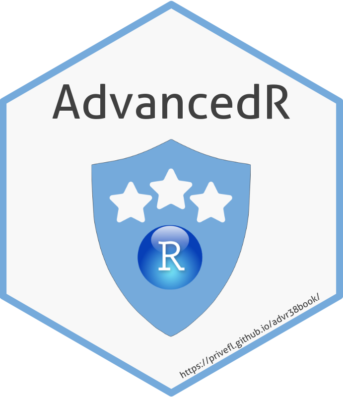

--- 
title: "Advanced R"
subtitle: "PhD course offered by the Graduate School of Health, Aarhus University"
author: "Florian Privé"
date: "`r Sys.Date()`"
site: bookdown::bookdown_site
documentclass: book
bibliography: [book.bib]
biblio-style: apalike
link-citations: yes
description: "This document contains all the materials used in connection to the PhD course about Advanced R held first at the doctoral school of Grenoble, France, and afterwards at the Graduate School of Health, Aarhus University, Denmark."
twitter-handle: "privefl"
github-repo: "privefl/advr38book"
url: 'https\://privefl.github.io/advr38book/'
cover-image: "images/new_hexsticker.png"
---


# Preface {.unnumbered}

```{r setup, include=FALSE}
source("knitr-options.R")
# source("spelling-check.R")
```

This book is based on materials originally developed for the doctoral school of Grenoble, France. It is now used as the main course material for the PhD course **Advanced R** offered by the Graduate School of Health, Aarhus University, Denmark.
The main aim of this book is to give the reader a greater understanding of the `R` language, and to enable them to produce more clean, sophisticated and efficient `R` code. The reader will learn about packages and tools to simplify their coding life, about data analysis and visualization, and about best practices when coding in `R`.
After studying these materials, the reader should be able to

* use RStudio with a better setup to be more efficient
* use Git as a version control system to track file changes
* understand how to write better and simpler code in `R`
* manipulate and visualize data with the tidyverse and R Markdown
* produce efficient `R` code
* develop an `R` package.


## How to read this book {.unnumbered}

Readers are recommended to have a basic understanding of `R` and some experience writing `R` code. You should, for example, be able to create variables, define functions, implement loops and subset objects such as vectors and data frames. 
If you are new to `R`, you can take a look at Garrett Grolemund's [Hands-On Programming with R](https://rstudio-education.github.io/hopr/) (2014), a book that uses hands-on examples to teach you how to program in `R`. Some other useful resources are

* [Basic Basics](https://rladiessydney.org/courses/ryouwithme/01-basicbasics-0/), a lesson unit from [R-Ladies Sydney](https://rladiessydney.org/) providing an opinionated tour of RStudio for new users and a step-by-step guide to installing and using `R` packages.
* [A Gentle Introduction to Tidy Statistics in R](https://posit.co/resources/videos/a-gentle-introduction-to-tidy-statistics-in-r/) (Thomas Mock, 2019), a one-hour free video webinar about how to get started quickly with basics of research statistics in `R`.
* [Posit Recipes](https://posit.cloud/learn/recipes), a collection of `R` code snippets and instructions featuring up-to-date best practices for coding in `R`.
* [The RStudio Essentials Series](https://www.rstudio.com/tags/essentials/), a webinar series about how to program and manage `R` projects using RStudio's tools. These videos will also help you learn good development practices. 

Finally, posit also provides some very useful [cheatsheets](https://posit.co/resources/cheatsheets/), for example about the [RStudio IDE](https://rstudio.github.io/cheatsheets/html/rstudio-ide.html), that you may find helpful.

In total, this book consists of eight chapters. The first chapter is a short introduction covering prerequisites, content and other useful resources. The following six chapters are theoretical and cover the following topics

* Good practices
* Advanced `R` programming
* Data analysis with the tidyverse
* Code performance
* How to make an `R` package
* Introduction to Shiny Apps.

The final chapter is an opportunity for the reader to apply the new theory using real data from [Tidy Tuesday](https://github.com/rfordatascience/tidytuesday/blob/master/README.md).

The reader does not need to read through the materials from beginning to end. We have tried to make each chapter as self-contained as possible, and the reader should be able to only read the parts that are most interesting or relevant. 

## About the Author {-}

[Florian Privé](https://privefl.github.io/) is a researcher in predictive human genetics, fond of Data Science and an R(cpp) enthusiast. He is also the founder and former organizer of [the Grenoble R user group](https://r-in-grenoble.github.io/). You can find him on [Twitter](https://twitter.com/privefl) and [GitHub](https://github.com/privefl) as \@privefl and on [Stack Overflow](https://stackoverflow.com/users/6103040/f-priv%c3%a9) as F. Privé.

## License {-}

This material is licensed under the [Creative Commons Attribution-ShareAlike 3.0 License](http://creativecommons.org/licenses/by-sa/3.0/). 

```{r, out.width="80%", echo=FALSE}

```

