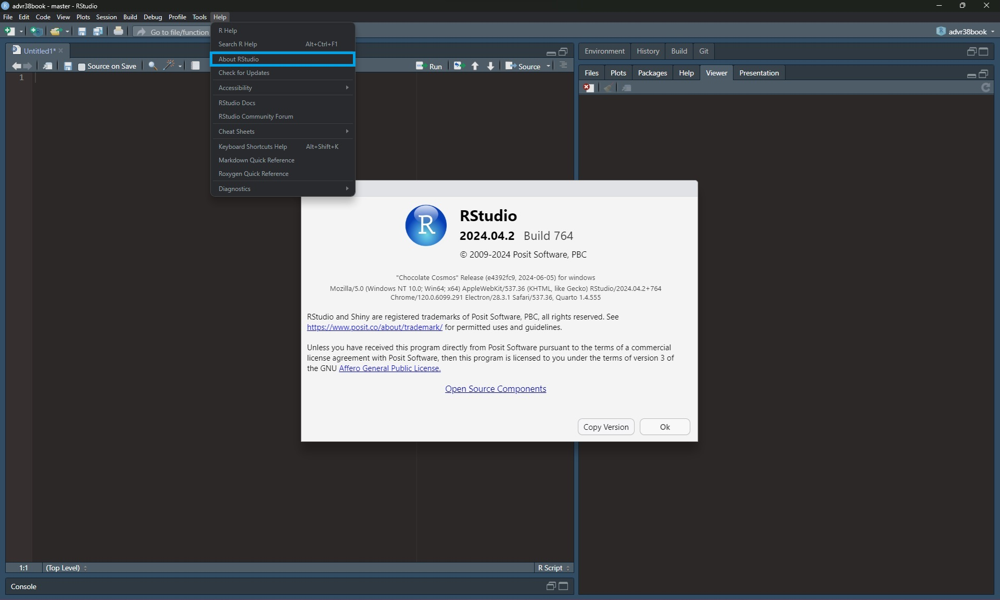

# Introduction

```{r setup, include=FALSE}
source("knitr-options.R")
source("spelling-check.R")
```

## Prerequisites {.unnumbered}

To get the most out of these materials, you should have a basic understanding of `R` and some experience writing `R` code. You should, for example, be able to create variables, define functions, implement loops and subset objects such as vectors and data frames. 
Furthermore, you should

- install the most recent version of [R](https://www.r-project.org/). In this book, we will use `R` version 4.4.1. Make sure that you have installed `R` version >= 4.4.1 to run the examples and exercises provided throughout these materials. You can get your current version with `version[['version.string']]` or `R.Version()$version.string`.
Once you have downloaded and installed the desired version of `R`, go to `Tools > Global Options...` and change the `R` version. Remember to restart `R` afterwards.

<center>
<video width="560" height="315" autoplay loop muted preload="true" poster="images/Change_R_version.jpg"> 
<source src="Clips/Change_R_version.mp4" type="video/mp4">
Your browser does not support the video tag.
</video>
</center>

- install the most recent version of [RStudio](https://www.rstudio.com/products/rstudio/download/#download). In this book, we will use RStudio version 2024.04.2. You can get the current version of your R Studio by opening `Help > About RStudio` (on Windows) or `RStudio > About RStudio` (on Mac).   
```{r, out.width="50%", echo=FALSE}

```

- install the package **advr38pkg** with `remotes::install_github("privefl/advr38pkg")`. This will also install other dependencies needed in this book. Please note that you might need to install the package `remotes` first using `install.packages("remotes")`.

- install [Git](https://git-scm.com/downloads). Once the version control system has been installed, you need to activate it. Go to `Tools > Global Options > Git/SVN` and click `Enable version control interface for RStudio projects`. If necessary, enter the path for the Git executable. 

<center>
<video width="560" height="315" autoplay loop muted preload="true" poster="images/Activate_git.jpg"> 
<source src="Clips/Activate_git.mp4" type="video/mp4">
Your browser does not support the video tag.
</video>
</center>

- create a [GitHub](https://github.com/) account.

## Content {.unnumbered}

It is impossible to become an expert in `R` in one training course only. Yet, these materials aim at giving a wide understanding of many aspects of `R`. This is done by breaking the book into smaller parts, each covering a single aspect of `R`. Chapter 2 covers good practices in `R`, i.e. good coding style, using the RStudio IDE, version control, and how to get help when you are stuck. Chapter 3 introduces base `R` concepts that are important to really understand `R` as a programming language. These concepts are base `R` objects, their types and accessors, useful base `R` functions, environments and scoping, along with attributes and classes. Chapter 4 is an introduction to data analysis with the tidyverse. In this chapter, we will introduce tidy data and tibbles, transform data with dplyr, and visualize data with ggplot2. Chapter 5 is all about performance: `R`'s memory management, vectorization, Rcpp, linear algebra, algorithms and data structures along with parallel computing. In Chapter 6, we will look at how to make an `R` package. Chapter 7 introduces Shiny Apps. The final chapter, Chapter 8, introduces [Tidy Tuesday](https://github.com/rfordatascience/tidytuesday/blob/master/README.md). In this chapter you will also find a project that you can make if you want to apply the theory to real data.

You do not need to read through the materials from beginning to end. We have tried to make each chapter as self-contained as possible, and you should be able to only read the parts that are most interesting or relevant to you. 

Most chapters do refer to external resources that you can use to deepen what you have learned in this book. You will find these resources at the end of each chapter.


## Useful resources {.unnumbered}

- [Course on R debugging and robust programming](https://github.com/lgatto/2016-02-25-adv-programming-EMBL) by Laurent Gatto & Robert Stojnic,

- [Data Challenge Lab](https://dcl-2017-04.github.io/curriculum/upcoming.html) by Hadley Wickham,

- [Advanced R](http://adv-r.had.co.nz/) by Hadley Wickham, and [some solutions](https://bookdown.org/Tazinho/Advanced-R-Solutions/),

- [R for Data Science](http://r4ds.had.co.nz/index.html) by Garrett Grolemund & Hadley Wickham, and [some solutions](https://jrnold.github.io/r4ds-exercise-solutions/),

- [R packages](http://r-pkgs.had.co.nz/) by Hadley Wickham,

- [Efficient R programming](https://bookdown.org/csgillespie/efficientR/) by Colin Gillespie & Robin Lovelace,

- [R Programming for Data Science](https://bookdown.org/rdpeng/rprogdatascience/) by Roger D. Peng,

- [Mastering Software Development in R](https://bookdown.org/rdpeng/RProgDA/) by Roger D. Peng, Sean Kross and Brooke Anderson.


