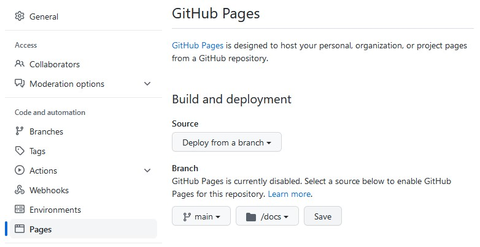

# Packages {#packages}

```{r setup, include=FALSE}
WORDS_TO_IGNORE <- c("ci", "Codecov", "programmation", "prefered")
source("knitr-options.R")
source("spelling-check.R")
```

## Resources

- [R Packages book](http://r-pkgs.had.co.nz/) (**read it!**)

- [Writing R extensions, the official CRAN guide](https://cran.r-project.org/doc/manuals/r-release/R-exts.html) (easier to read as a [bookdown](https://colinfay.me/writing-r-extensions/))

- Look at popular R packages on GitHub

- [Customizing Package Build Options](https://support.posit.co/hc/en-us/articles/200486518-Customizing-Package-Build-Options-in-the-RStudio-IDE)

- [Mastering Software Development in R](https://bookdown.org/rdpeng/RProgDA/building-r-packages.html)

- [How to develop good R packages (for open science)](http://www.masalmon.eu/2017/12/11/goodrpackages/)

- [How to decide when to trust an R package?](https://github.com/jtleek/simplystats_posts_sisbid/blob/master/posts/2015-11-06-how-i-decide-when-to-trust-an-r-package.md)

## Project exercise

Just to experiment with making an R package, we'll try to make a small package that implements some of the features of package {dplyr} that we learned in chapter \@ref(tidyverse). We can call this package {minidplyr}.

1. After having read the following two sections (\@ref(pkg-start) and \@ref(pkg-basics)), create a first function that helps you `select` variables of a data frame by using a character vector of variable names or an integer vector of variable positions. Which accessor could you use? Document this function and use it. Bonus (for later): can you use base R function `subset` to use variables names without quoting them?

1. Check your package with `Ctrl/Cmd + Shift + E` and fix all problems. At this point, there should be no ERROR or WARNING, unless you did not document the previous function properly. However, you should still update the *DESCRIPTION* file with proper information. Do it, fix any problem, and run checks again. You could submit this package to CRAN in its present form; congratulations on your new R package!

1. Commit everything and push to GitHub. Try to install the package from someone else using `remotes::install_github("<github-username>/minidplyr")`.

1. Learn how to make unit tests in section \@ref(pkg-tests) and do that for your new function `select2`. Which silly cases you should test? Here, you can use `usethis::use_package("dplyr", type = "Suggests")` to add package {dplyr} to the suggested packages (because you will use this package in tests only). You can see [the unit tests I came up with for this function](https://github.com/privefl/minidplyr/blob/master/tests/testthat/test-select.R).

1. Make a function `filter2` that enables to filter rows of a data frame. Add some documentation and tests for this function as well.

1. Learn about continuous checking of your package in section \@ref(pkg-ci). Follow the instructions, commit and push your changes. Go check your new badges on GitHub!

1. Learn how to make a website out of your package in section \@ref(pkgdown) and build one for this package (or another of your packages).

1. Implement more functions if you find this project interesting. For example, make a function `mutate2` with the help of base R function `transform` (or `within`). Try to make the previous functions more general by taking many arguments at once (in `...`). **Make sure to keep your existing code as internal functions in order to break your code in manageable parts.**


## Quick start {#pkg-start}

In my first package, I just put some functions I used again and again in my work.

To quickly start your package, just follow these steps:

1. Create a new RStudio project (not a package). Here, I advise you to create a new project on GitHub (with a README) and then clone it as an RStudio project. It is a good practice to put all your (public) stuff on GitHub (as we learned in section \@ref(git)).

1. Run the following lines of R code.

    ```{r, eval=FALSE}
    usethis::use_description(list(License = "GPL-3"))
    usethis::use_namespace()
    dir.create("R")
    usethis::use_package_doc()
    usethis::use_roxygen_md()
    ```

1. **Restart RStudio** and change the following options. You should see a new "Build" panel next to the "Git" panel.

    ```{r, echo=FALSE, out.width = "60%"}
    knitr::include_graphics("https://privefl.github.io/R-presentation/build-doc.png")
    ```

1. Then use `Ctrl/Cmd + Shift + B` to build and reload your package.

1. Create a simple function and put it in an `.R` file in the `R/` directory. Inside the function, use *Code -> Insert Roxygen Skeleton*. Build and reload your package and check the documentation of your new function and that you can use it.


## Basic stuff {#pkg-basics}

### *DESCRIPTION* file

See [this chapter on the DESCRIPTION file](https://r-pkgs.org/description.html).

### R code

- Put your R code in the `R/` directory. Basically it would be mostly functions. Don't use random lines of code like in R scripts.

- Never explicitly load a package with `library()` or `require()`. Use `usethis::use_package()` to add one package to your *DESCRIPTION* file. Then, refer to some function with `<package>::<function>()` in your code, or by using the `@import <package>` or `@importFrom <package> <function>` roxygen tags.

- If one R function need another function in another R file, use the `@import <basename>.R` to make sure it is built and documented before; it is for example useful if you define new generics and methods in different files. 

- If you modify global `options()` or graphics `par()` in a function of your package (try to avoid it), save the old values and reset when you are done:

    ```{r, eval=FALSE}
    old <- options(stringsAsFactors = FALSE)
    on.exit(options(old), add = TRUE)
    ```

### Documentation

Documentation is super useful for other people (including future-you, in 6 months when you won't remember what you implemented in your package). Make sure to document your code as soon as you write it, otherwise you will never do it.

Forget about the `man/` (manual) directory, files in this directory will be automatically generated thanks to the roxygen comments you use on top of your R functions. 

Learn more with [this chapter](http://r-pkgs.had.co.nz/man.html). Note that you can now use the Markdown syntax in the documentation. For example, instead of having to use `\code{foo}`, you can directly use `` `foo` `` in the roxygen comments.

To use (and export) functions already implemented in other packages, for example the pipe from package {magrittr}, you can use `usethis::use_package("magrittr")` and put the following code somewhere in an R file of your package.

```{r, eval=FALSE}
#' @importFrom magrittr %>%
#' @export
magrittr::`%>%`
```

Fun: [[How to] Include a dancing banana in your R package documentation](http://colinfay.me/dancing-banana-r-package-doc/).

### *NAMESPACE* file

You can also forget about this for now because it should be automatically generated by {roxygen}.

If you want to understand what's going on, read [this chapter](https://r-pkgs.org/dependencies-mindset-background.html#sec-dependencies-namespace).


## Good practices

### Testing {#pkg-tests}

You are probably already testing your code, you're only doing it informally. The problem with this approach is that when you come back to this code in 3 months time to add a new feature, you’ve probably forgotten some of the informal tests you ran the first time around. This makes it very easy to break existing code that used to work (which you should avoid as much as you can). A very good practice is to use unit tests.

Read [this chapter](https://r-pkgs.org/testing-basics.html).

To make your first unit tests, use `usethis::use_test()` while having open the R file you want to test. Write some unit tests, then you can run tests of your package with `Ctrl/Cmd + Shift + T`.

### Continuous checking {#pkg-ci}

I would rarely trust a package that doesn't use these continuous integration services.
It's good practice to check your package regularly and on different Operating Systems (OS). Learn more about the different checks [there](http://r-pkgs.had.co.nz/check.html).

An easy way to regularly check your package on GitHub is to use [GitHub Actions](https://github.com/features/actions). Indeed, each time you push to your GitHub repository, checks are run on different OS. To use this service, you can run `usethis::use_github_action_check_standard()`. 

To get the coverage of your tests, use [Codecov](https://codecov.io/) by running `usethis::use_coverage()` and `usethis::use_github_action("test-coverage")`.

Finally, to prevent typos in your package and especially for non-native English speakers, it can be useful to check the spelling in your package. If you think that the word "programmation" exists and that "prefered" has only one 'r' at the end (I did!), you should definitely use package {spelling}. Just run `spelling::spell_check_setup()`; this will check spelling in your package at the end of checks. If it reports words you want to ignore, just put these words in a text file `inst/WORDLIST` (with one word by line).

### Pkgdown {#pkgdown}

1. Run `usethis::use_pkgdown()`. If added, remove `docs` from the *.gitignore* file.

1. Run `pkgdown:::build_site()`.

1. On GitHub, go to the settings of your repo, and enable GitHub Pages from the `/docs` folder. 
```{r, echo=FALSE}

```

1. Push the new files. This will render everything that you have in this folder as a website (after 0-2 minutes). 

To get more information and especially to configure the website, see [the documentation](http://pkgdown.r-lib.org/articles/pkgdown.html), as a {pkgdown} website, of course.
For an example, see [the website of my package {bigstatsr}](https://privefl.github.io/bigstatsr/) and [the corresponding YAML file](https://github.com/privefl/bigstatsr/blob/master/_pkgdown.yml). 

If you want to make a personal website, check [this quick tutorial](https://github.com/privefl/rmarkdown-website-template#make-your-website-with-r-markdown-in-minutes).


## More

### Rcpp

We learned about Rcpp in section \@ref(Rcpp). To use Rcpp code in your package, just use `usethis::use_rcpp()` and put the 2 roxygen tags e.g. in the file `R/<package>-package.R`. Then, create .cpp files with RStudio and save them the `src/` directory.

Note that the `// [[Rcpp::export]]` makes the C++ function available to R, it doesn't export the function as part of your package (though you could access it with `<package>:::<rcpp-fun>()`). If you want your package to explicitly provides an Rcpp function (as an R function), you also need roxygen comments (beginning with `//'` instead of `#'`, including `//' @export`) on top of your Rcpp function.

If you need some C++ code from another package (e.g. from package {RcppArmadillo}), normally you would use
```{Rcpp, eval=FALSE}
// [[Rcpp::depends(RcppArmadillo)]]
#include <RcppArmadillo.h>
```
In an R package, you don't need the first line but instead you need to add the package to the `LinkingTo` field of the *DESCRIPTION* file (e.g. with `usethis::use_package("RcppArmadillo", "LinkingTo")`).

### Ignore files

There are two types of ignore:

- Files ignored by Git, specified in the *.gitignore* file. For example, you don't want to track changes for some large data files or some binaries often changing. You can ignore files by using `usethis::use_git_ignore()`.

- Files ignored during the build of your package, specified in the *.Rbuildignore* file. For example, in my packages, I generally have two directories called `tmp-tests` and `tmp-save` where I just put some random code that I used once during development. Checks will tell you if your package contains non-standard files or directories. Moreover, I generally ignore vignettes; they are still built as part of the {pkgdown} website. 
There is also a {usethis} function for this: `usethis::use_build_ignore()`.

### The `inst/` directory

When a package is installed, everything in `inst/` is copied into the top-level package directory.

For example, you can have:

- `inst/extdata/`: additional external data for examples and vignettes. See section \@ref(pkg-data) for more detail. You can also use `inst/testdata/` for data you need in tests. To access one file in this directory, use `system.file()`. For example, if you have a file `inst/extdata/mydata.csv` in your package, an user can find it using `system.file("extdata", "mydata.csv", package = "<package>")`.

- `inst/include`: some C++ code that others can use by `LinkingTo` your package. For example, when you use `#include <Rcpp.h>` at the top of your Rcpp code, you're using the code in [there](https://github.com/RcppCore/Rcpp/blob/master/inst/include/Rcpp.h).

- `inst/CITATION`: how to cite the package. Learn more [there](http://r-pkgs.had.co.nz/inst.html#inst-citation).

### External data {#pkg-data}

Learn more with [this book chapter](http://r-pkgs.had.co.nz/data.html).


## Release on CRAN

If you want your package to be on CRAN, read [this chapter](http://r-pkgs.had.co.nz/release.html).
