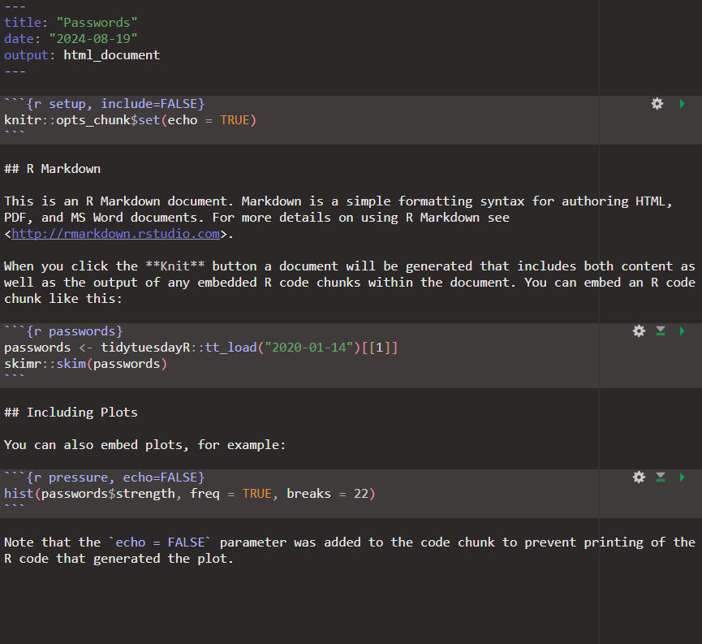
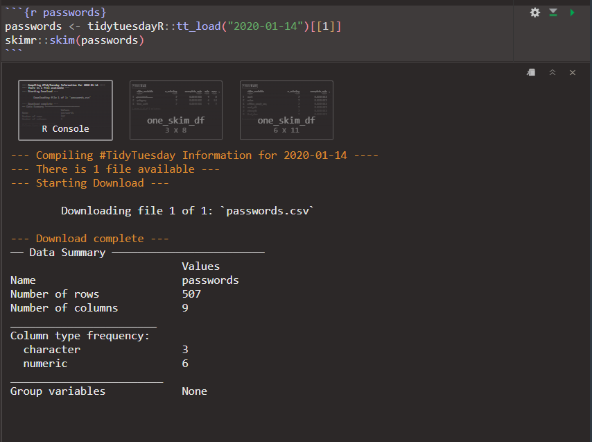

# R Markdown {#rmarkdown}

```{r setup, include=FALSE}
WORDS_TO_IGNORE <- c("Allaire", "Gruber", "Gruber's", "MacFarlane", "md", "pandoc", "Rmd", "rmarkdown", "Yihui", "Julyan", "Arbel", "Beamer", "ioslides", "Slidy", "De", "Desirée", "edu", "rstudio", "Zieffler", "customise", "emdash", "endash", "strikethrough", "subscipt", "nd", "th")
source("knitr-options.R")
source("spelling-check.R")
```

```{r, echo=FALSE, fig.align='center', out.width='25%'}
knitr::include_graphics("images/rmarkdown.png")
```

When writing package documentations with `roxygen2`, building websites for `R` packages with `pkgdown`, or building a personal website, you will not be able to get past R Markdown. R Markdown is rightly used everywhere; Indeed, these materials are written in R Markdown. 

But what is R Markdown? R Markdown is a file format for making reproducible, dynamic documents with `R`. A single R Markdown file can be used to save and execute code, and to generate high quality reports that can be shared with an audience. An R Markdown document is written in Markdown and contains plain text and embedded `R` code and results. In this chapter, we will take a closer look at R Markdown.

**<font size ="4">What is Markdown?</font>**

Markdown is a simple markup language with plain text formatting syntax. And what is a markup language? It is a text-encoding system: A set of symbols is inserted in a text document to control its structure, formatting, etc. You probably know HTML; the standard markup language for creating Web pages. 
The extension of a Markdown file is typically *.md*, but a Markdown document can be converted to many formats (including HTML, PDF, and MS_Word). The original version of Markdown was created by John Gruber in 2004; completely independent of `R`. John Gruber's aim was to create a markup language that was easy to read and easy to write. He may have overshot the target; The original version of Markdown was often found overly simple and not suitable to write highly technical documents. 

Fortunately, two years later, John MacFarlane created the universal document converter [pandoc](https://pandoc.org/index.html). In this connection, the Markdown syntax was significantly enriched, making Markdown an excellent authoring framework for data science. 

**<font size ="4">Adding `R` to Markdown</font>**

**R Markdown** is an extension of the markdown syntax that enables `R` code to be embedded in the document.  The typical extension for an R Markdown file is *.Rmd*. 
Converting an R Markdown document to a specific output format requires two steps:

1. The .Rmd file needs to be send to [knitr](https://yihui.org/knitr/), which executes the R code chunks and creates a new markdown (.md) document including the R code and its output.
2. Afterwards, the markdown file generated by knitr needs to be processed by pandoc, which is responsible for creating the finished file. 

Fortunately, we don't have to perform these steps every time we want to render an R Markdown document. The package `rmarkdown`, which is automatically installed and loaded in RStudio, provides a function that performs the processing steps for you; the function is called `render()`. Moreover, RStudio has a *Knit* button () at the top of the **Source pane** that enables you to render an .Rmd file and preview it with a single click (or keyboard shortcut *Ctrl+Shift+K* / *Shift+Command+K*). 


The only drawback of using R Markdown is that help is not always available through the `help()` function. R Markdown integrates a variety of R packages and external tools; making it difficult to provide help for everything. Instead, you should consider the [R Markdown Reference Guide](https://www.rstudio.com/wp-content/uploads/2015/03/rmarkdown-reference.pdf), the [R Markdown Cheat Sheet](https://rstudio.github.io/cheatsheets/html/rmarkdown.html) (an older version can be found [here](https://www.rstudio.com/wp-content/uploads/2015/02/rmarkdown-cheatsheet.pdf)), and the [rmarkdown website](https://rmarkdown.rstudio.com/index.html), which is also made with R Markdown (of course). 

## R Markdown basics 

Now that we have established what R Markdown is and what it can be used for, let us look at what a R Markdown document looks like. To create a new R Markdown document, you can either

- Go to File -> New File -> R Markdown...
- Click on  in the upper-left corner of the RStudio menu (above the **Source pane** and select  R Markdown...
- Open a blank text document  and save this file with the extension *.Rmd*, i.e. [file_name].Rmd. 
- Click on  New Blank File in the **Files** tab of the **Output pane** and select  R Markdown... to create a file in the current directory.

<center>
<video width="560" height="315" autoplay loop muted preload="true"> 
<source src="Clips/Open_R_Markdown_document.mp4" type="video/mp4">
Your browser does not support the video tag.
</video>
</center>

Using options one and two will open a pop-up window that looks like this:

```{r pop-up, echo=FALSE, fig.cap="How to create an R Markdown file"}
knitr::include_graphics("images/RMarkdownPopup.png")
```

If you want to create an empty document without any pre-defined options, click on `Create Empty Document` in the lower-left corner. You can also create an HTML, PDF, or Word document, presentations (ioslides, Slidy, Beamer or PowerPoint), interactive Shiny documents or presentations, or open R Markdown templates using the menu to the left and the suggested default output formats. Finally, you can specify a title, author and date. Once you have selected the desired output format and updated the title, author and date, select `OK`. RStudio will now open an R Markdown document that looks similar to the one shown below:

```{r, echo=FALSE}

```

The document contains three important types of content:

1. An (optional) YAML header
2. Chunks of R code
3. Text mixed with simple text formatting 

In the following, we will explore each component in more detail. 

### The YAML header {.unnumbered}

An R Markdown document starts with an (optional) YAML header surrounded by a line of three hyphens `---`. This is where you can specify (or update) metadata about the document and rendering instructions. When you create an R Markdown file using the wizard shown in Figure \@ref(fig:pop-up), RStudio writes the YAML header for you. However, you can still update the existing options or add other metadata. Some commonly used YAML metadata options are:

- `title` : A descriptive main title. 
- `author` : Name of the author(s). You can use lists for multiple authors and for adding other metadata, for example:
    ```{r, eval=FALSE, results='asis'}
    author:
      - Name_1
      - Name_2
        
    author:
      - name: Name_1
      - affiliation: University of Somewhere
      - name: Name_2
      - affiliation: Uiversity of Somewhere else
    ```  
- `date` : The date shown in the document. You can write a date or execute `R` code to update the date automatically.
    ```{r, eval=FALSE, results='asis'}
    date: "`r format(Sys.time(), '%d %B, %Y')`"
    date: "`r lubridate::today()`"
    ``` 
- `abstract` : A summary of the analyses. Multiple paragraphs can be specified but they must be indented and preceded by `|`:
    ```{r, eval=FALSE, results='asis'}
    abstract: |
      The first paragraph of this abstract.
      
      The second paragraph of the abstract.
    ``` 
- `output` : Document specific YAML options. The first option specified here needs to be the document type (e.g. `html_document` in the example above). A full list of supported document types can be found in colored box at the end of this section. Each output format can be accompanied with several format options. All these format options must be indented, e.g.
    ```{r, eval=FALSE}
    output:
      html_document:
        toc: true
    ```
    Some of the most commonly used document specific options are:
    * `toc` : true/false to show table of contents.
    * `toc_debth` : A number determining how many subheadings will be visible in the table of contents. Defaults to three.
    * `toc_float` : true/false determining whether the table of contents stays visible when scrolling down.
    * `theme` : The overall look of the document. You can see a list of available R Markdown Themes in [Appendix F *R Markdown Themes*](https://rstudio4edu.github.io/rstudio4edu-book/rmd-themes.html) of *rstudio4edu* by Desirée De Leon and Alison Hill, or in the [R Markdown Theme Gallery](https://www.datadreaming.org/posts/2018-04-11-r-markdown-theme-gallery/2018-04-11-r-markdown-theme-gallery) created by Andrew Zieffler.

<div class="warning" style='background-color:#76aada; color: #59463f; border-left: solid #32597c 4px; border-radius: 4px; padding:0.7em;'>
<span>
<p style='margin-top:1em; text-align:center'>
<b>Supported document types:</b></p>
<p style='margin-left:1em;'>
- beamer_presentation
- context_document
- github_document
- html_document
- ioslides_presentation
- latex_document
- md_document
- odt_document
- pdf_document
- powerpoint_presentation
- rtf_document
- slidy_presentation
- word_document
<br><br>
Other extension packages provide more output formats. However, if you want to use an output format from an extension package, you have to include the package name in the YAML header: 
```{r, eval=FALSE, results='asis'}
output: tufte::tufte_html
``` 
</p></span>
</div>

### `R` code chunks {.unnumbered}

Following the metadata is the body of the R Markdown file. The second important type of content is found in the body; namely chunks of `R` code surrounded by ` ```{r} ` and ` ``` `. Following the three ` ``` `in the beginning is `{r}`. This tells Markdown that the code chunk contains `R` code. Besides `R`, `knitr`can execute code written in Python, SQL, Bash, Rcpp, Stan, JavaScript and CSS. Simply replace `{r}` at the top of the code chunk with the name of the desired language. 
You can insert a chunk in three different ways:

- By manually typing the chunk delimiters  ` ```{r} ` and ` ``` `
- By clicking the insert button icon  in the editor toolbar at the top of the **Source pane**
- or by using the keyboard shortcut *Ctrl+Alt+I* / *Command+Option+I*.

Even though you are working within an R Markdown document, you can still execute current line/selection of code in a code chunk using the keyboard shortcut  *Ctrl+Enter* / *Command+Return*. If you want to run all code in a chunk, you can click  in the upper-right corner of the code chunk or use the shortcut *Ctrl+Shift+Enter* / *Command+Shift+Return*. 
When you run code in a chunk, the output is displayed in the console as usual, and all objects are stored in the current environment. However, RStudio will also show the        output below the code chunk: 
    
```{r, echo=FALSE}

```
    
You can customise the chunk output with options by specifying them in the chunk header ` ```{r} `. `knitr` provides almost 60 options that you can use to customise code chunks. The most important options are:

* `eval` : Whether to evaluate the code and include its results. Defaults to `TRUE`.
* `echo` : Whether to display code along with its results. Defaults to `TRUE`.
* `include` : Whether to show the code and its results in the final document. Defaults to `TRUE`. This is used for setup code.
* `warning` : Whether to display warnings. Defaults to `TRUE`.
* `error` : Whether to display errors. Defaults to `FALSE`.
* `message` : Whether to display messages. Defaults to `TRUE`.
* `tidy` : Whether to reformat code in a tidy way when displaying it. Defaults to `FALSE`.
* `collapse` : Whether to merge text output and source code into a single code block in the output. Defaults to `FALSE`.
* `results` : Controls how to display the text results. Defaults to `markup`.
* `cache` : Whether to cache results for future renders. Defaults to `FALSE`.
* `comment` : Comment character to preface results with. Defaults to `##`.
* `fig.width` : Width in inches for plots created in chunk. Defaults to 7.
* `fig.height` : Height in inches for plots created in chunk. Defaults to 7.
* `fig.align` : The alignment of plots. Defaults to `default`, i.e. no alignment adjustments are made.

You can find all options in the package documentation for [knitr](https://yihui.org/knitr/options/).

### Plain text with simple text formatting {.unnumbered}

The last important type of content often constitutes most of the body of an R Markdown file: plain text mixed with simple text formatting. In the following, we will provide a quick overview over the most commonly used R Markdown syntax:
<table>
  <tr>
    <th>Syntax</th>
    <th>Output</th>
  </tr>
  <tr>
    <td>plain text</td>
    <td>plain text</td>
  </tr>
  <tr>
    <td>\*italics\* or \_italics\_</td>
    <td>*italics*</td>
  </tr>
  <tr>
    <td>\*\*bold\*\* or \_\_bold\_\_</td>
    <td>**bold**</td>
  </tr>
  <tr>
    <td>subscipt\~2\~ </td>
    <td>subscipt~2~</td>
  </tr>
  <tr>
    <td>superscript\^2\^</td>
    <td>superscript^2^</td>
  </tr>
  <tr>
    <td>\~\~strikethrough\~\~</td>
    <td>~~strikethrough~~</td>
  </tr>
  <tr>
    <td>endash: \-\-</td>
    <td>endash: -- </td>
  </tr>
  <tr>
    <td>emdash: \-\-\-</td>
    <td>emdash: ---</td>
  </tr>
  <tr>
    <td>inline `R` code: `` ` `` r mean(1:4) `` ` `` </td>
    <td>inline `R` code: `r mean(1:4)`</td>
  </tr>
  <tr>
    <td>inline equation: \$A = \\pi \\times r\^\{2\}\$</td>
    <td>inline equation: $A = \pi \times r^{2}$</td>
  </tr>
  <tr>
    <td>image: 	\! [optional caption text]	\(path/to/image.png)</td>
    <td>image: </td>
  </tr>
  <tr>
    <td>[link]\(https://rmarkdown.rstudio.com/) </td>
    <td>[link](https://rmarkdown.rstudio.com/)</td>
  </tr>
  <tr>
    <td>\# 1st level header </td>
    <td>**<font size ="6"> 1st level header  </font>**</td>
  </tr>
  <tr>
    <td>\#\# 2nd level header </td>
    <td>**<font size ="5"> 2nd level header  </font>**</td>
  </tr>
  <tr>
    <td>\#\#\# 3rd level header</td>
    <td>**<font size ="4"> 3rd level header  </font>**</td>
  </tr>
  <tr>
    <td>\#\#\#\# 4th level header</td>
    <td>**<font size ="3"> 4th level header  </font>**</td>
  </tr>
  <tr>
    <td>\#\#\#\#\# 5th level header</td>
    <td>**<font size ="2"> 5th level header  </font>**</td>
  </tr>
  <tr>
    <td>\#\#\#\#\#\# 6th level header</td>
    <td>**<font size ="1"> 6th level header  </font>**</td>
  </tr>
  <tr>
    <td>
    \* Bullet list item 1    
    \- Bullet list item 2    
    <p style="text-indent: 20px;">\+ Item 2a</p>
    <p style="text-indent: 20px;">\+ Item 2b</p>  
    </td>
    <td>
    * Bullet list item 1
    - Bullet list item 2
        + Item 2a    
        + Item 2b    
    </td>
  </tr>
  <tr>
    <td>
    1\. Numbered list item 1     
    1\. Item 2. The numbers are incremented automatically in the output    
    <p style="text-indent: 20px;">1\. Item 2a</p>
    <p style="text-indent: 20px;">1\. Item 2b</p>
    </td>
    <td>
    \newline
    1. Numbered list item 1     
    1. Item 2. The numbers are incremented automatically in the output
        1. Item 2a
        1. Item 2b
    </td>
  </tr>
  <tr>
    <td>\> block quote</td>
    <td><blockquote> block quote </blockquote> </td>
  </tr>
  <tr>
    <td>
    First Header  \| Second Header    
\-\-\-\-\-\-\-\-\-\-\-\-\-\-\-\-\-\|\-\-\-\-\-\-\-\-\-\-\-\-\-\-\-\-\-    
Content Cell  \| Content Cell    
Content Cell  \| Content Cell
</td>
    <td>
    First Header  | Second Header
------------- | -------------
Content Cell  | Content Cell
Content Cell  | Content Cell</td>
  </tr>
  <tr>
</table>

Finally, you can start a new paragraph by ending a line with four spaces,    
and you can insert a horizontal rule (or insert a slide break) with three or more asterisks (\*\*\*) or dashes (\-\-\-)

<hr>

You can find a similar list in the article [**Markdown Basics**](https://rmarkdown.rstudio.com/authoring_basics.html) on the `RMarkdown` website.

## Producing a complete report


### Exercise {.unnumbered}

**<font size ="4">Make your own website with R Markdown</font>**

## Summary


## Useful resources {.unnumbered}

- [R Markdown Quick Tour](https://rmarkdown.rstudio.com/authoring_quick_tour.html)
- [Introduction to R Markdown](https://rmarkdown.rstudio.com/articles_intro.html) by Garrett Grolemund
- [R Markdown: The Definitive Guide](https://bookdown.org/yihui/rmarkdown/) by Yihui Xie, J. J. Allaire and Garrett Grolemund
- [{R Markdown}](https://privefl.github.io/R-presentation/rmarkdown.html), a presentation by Florian Privé and Julyan Arbel. 
- [Chapter 27 **R Markdown**](https://r4ds.had.co.nz/r-markdown.html) of [R for Data Science](http://r4ds.had.co.nz/) by Hadley Wickham and Garrett Grolemund. 
